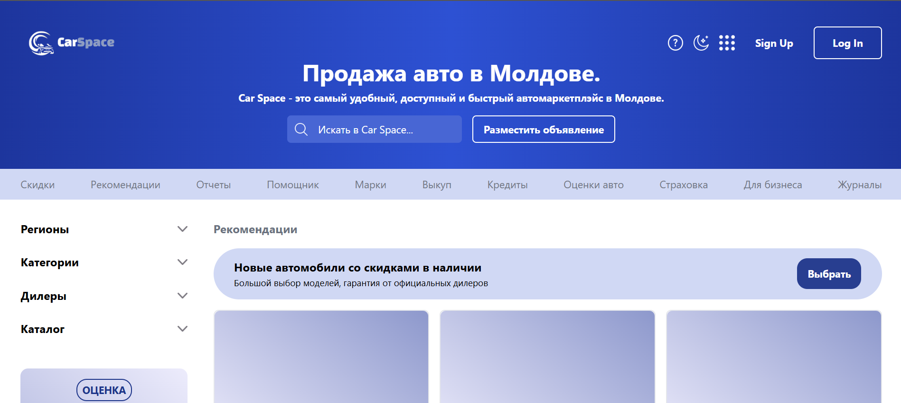
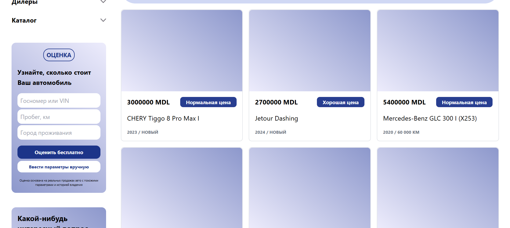
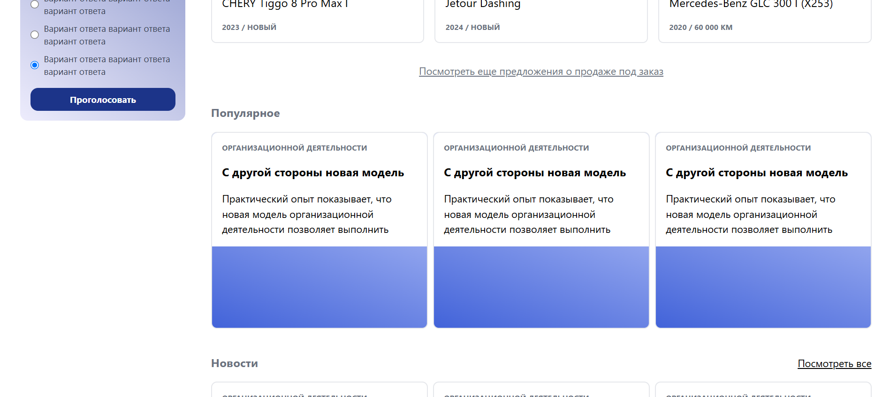
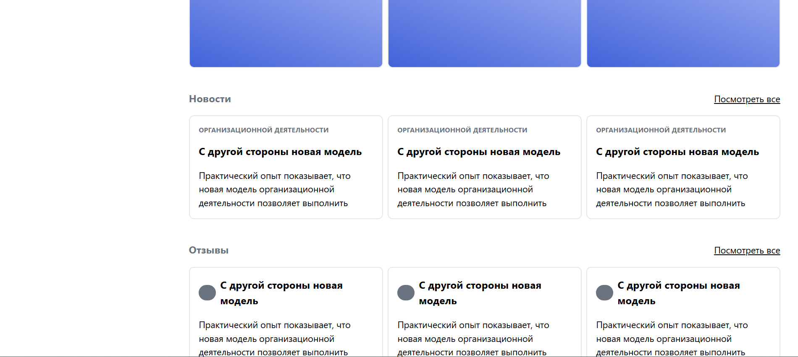

# CarSpace

## Vue-Based Concept Website for Client Presentation

**CarSpace** is a desktop-only concept project developed using **Vue.js**.  
It was created as a visual prototype to showcase to potential clients.

The homepage includes sections such as a **car listing**, **popular models**, **news**, and **user reviews**. All components were built based on the original **Figma** design.  
While the project was not fully launched to the public, it effectively demonstrates the layout and design intentions.

---

## 🏠 Home Page

## 🚗 Car Listing

## ⭐ Popular Section

## 📰 News Section

## 🗣️ Reviews Section

---

## 🔗 Live Preview

[View the project](https://car-space-zeta.vercel.app/)